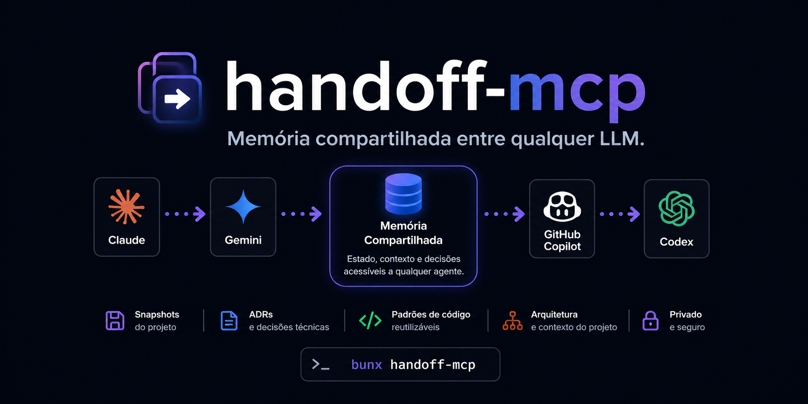

# handoff-mcp



MCP server that acts as a **shared memory hub** across multiple LLMs (Claude, Gemini, Copilot, Codex). Any agent entering a project immediately understands its architecture, patterns, and decisions — and can pick up exactly where the previous LLM left off.

## Tools

| Tool | Description |
|---|---|
| `create_or_get_project` | Initialize or retrieve a project |
| `save_architecture` | Save architecture overview and tech stack |
| `get_project_summary` | Full project overview — perfect as first call |
| `save_context_snapshot` | Save working state before handing off |
| `get_context_snapshot` | Retrieve what the previous LLM was doing |
| `list_sessions` | List all saved sessions |
| `save_code_pattern` | Save reusable code patterns (JWT, FCM, etc.) |
| `get_code_patterns` | Retrieve patterns by category/language |
| `save_architectural_decision` | Save an ADR (why a decision was made) |
| `get_decisions` | Retrieve architectural decisions |
| `search_context` | Search across patterns, decisions, and snapshots |

## Setup

No install needed. Just add the config below to your tool and it runs automatically via `bunx`.

> **Requires [Bun](https://bun.sh) installed on your machine.**
> Install it with: `curl -fsSL https://bun.sh/install | bash`

### Claude Desktop

File: `~/Library/Application Support/Claude/claude_desktop_config.json`

```json
{
  "mcpServers": {
    "handoff-mcp": {
      "command": "bunx",
      "args": ["handoff-mcp"]
    }
  }
}
```

### Claude Code

```bash
claude mcp add handoff-mcp bunx handoff-mcp
```

### Gemini CLI

File: `~/.gemini/settings.json`

```json
{
  "mcpServers": {
    "handoff-mcp": {
      "command": "bunx",
      "args": ["handoff-mcp"]
    }
  }
}
```

### GitHub Copilot (VS Code)

File: `.vscode/mcp.json` in your workspace

```json
{
  "servers": {
    "handoff-mcp": {
      "type": "stdio",
      "command": "bunx",
      "args": ["handoff-mcp"]
    }
  }
}
```

### OpenAI Codex CLI

File: `~/.codex/config.yaml`

```yaml
mcpServers:
  handoff-mcp:
    command: bunx
    args:
      - handoff-mcp
```

---

### Shared database (recommended)

By default each tool creates its own `context.db` in the working directory. To share the same memory across all LLMs, point them all to the same file:

```json
{
  "mcpServers": {
    "handoff-mcp": {
      "command": "bunx",
      "args": ["handoff-mcp"],
      "env": { "DB_PATH": "/Users/you/handoff.db" }
    }
  }
}
```

---

## Flow

```
Claude works on the project
→ create_or_get_project("my-app")
→ save_architecture({ description: "React Native + Spring Boot" })

Claude runs low on tokens
→ save_context_snapshot({
    llmModel: "claude-opus-4",
    taskDescription: "Implementing push notifications",
    recentChanges: "FCM handler done",
    nextSteps: "Wire up Foreground Service, test Android 16"
  })

Gemini takes over
→ get_project_summary("my-app")      # full context in one call
→ get_context_snapshot("my-app")     # picks up exactly where Claude stopped
→ continues...
```

## Dev

```bash
git clone https://github.com/Juan-Severiano/handoff-mcp
cd handoff-mcp
bun install
bun run dev      # watch mode
bun run inspect  # MCP Inspector
bun run build    # compile to dist/
```
